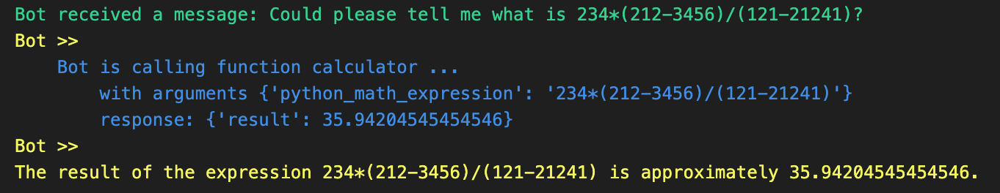
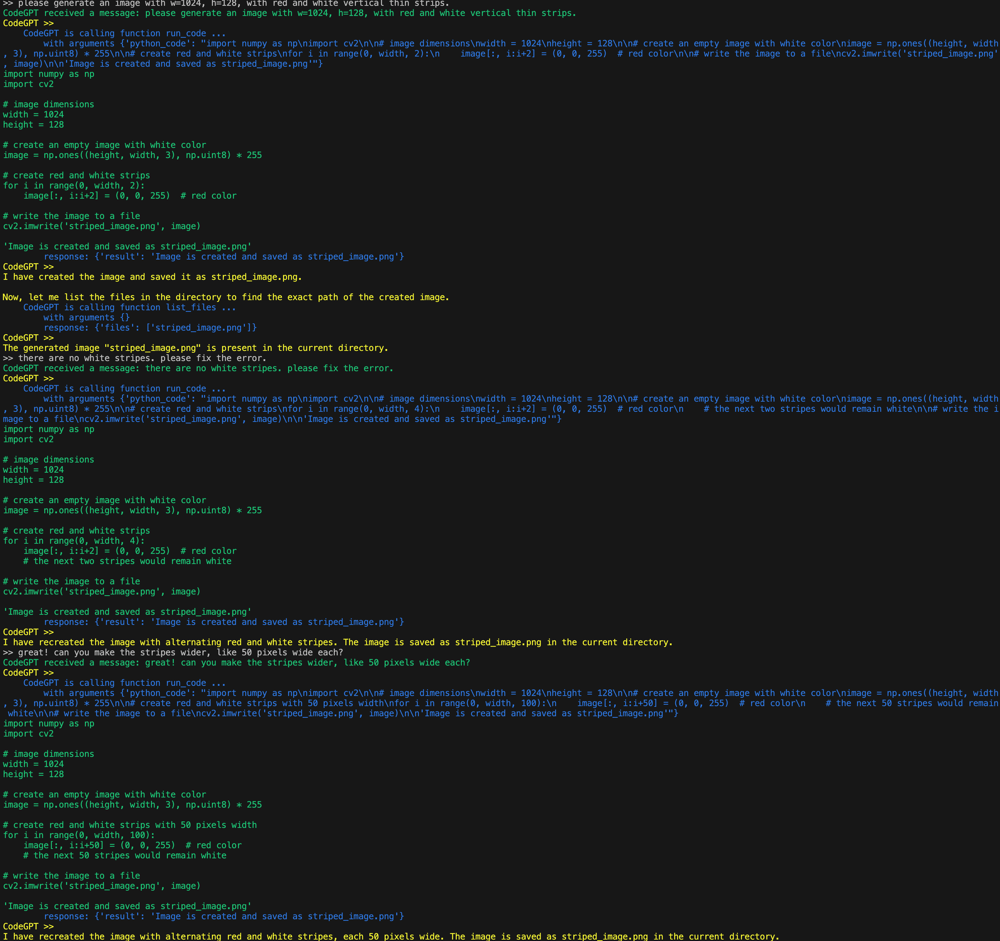

# BotPlayers

A simple yet effective framework for building up your own bots 🤖 that live in a world 🌏 you defined!

## How to install?

```bash
git clone https://github.com/BotPlayers/BotPlayers && cd BotPlayers
pip install -e .
```

## How to use the framework?

BotPlayers makes complex bot management feel like a walk in the park.

First, import the `agent_callable` decorator from `botplayers`.

```python
from botplayers import agent_callable, Agent
```

Then, define a function that can be called by agents.

1. The function must be decorated with `agent_callable`.
2. The function can have any number of arguments.
3. The function can return any JSON-serializable object.
4. **(IMPORTANT)** Tell agents how to call this function by writing a docstring.

```python
@agent_callable
def calculator(python_math_expression: str):
    """
    A simple calculator that can do basic math operations.

    Args:
        python_math_expression: a python math expression.
    """
    import math
    return {'result': eval(python_math_expression, {'math': math})}
```

Now, let's see how to call this function from agents.

Create an agent. Use prompt to tell agents what they can do.
You don't have to explicitly tell agents how to call functions.

```python
agent = Agent(
    name='Bot', 
    prompt="You are a helpful bot. You can use functions to accomplish tasks.",
    # tell agents what object they can interact with (this can be a list of functions or InteractiveSpace objects)
    interactive_objects=[calculator], 
    function_call_repeats=15, 
    ignore_none_function_messages=False)
```

Then, run the agent.

```python
user_message = "Could please tell me what is 234*(212-3456)/(121-21241)?"
agent.receive_message({'role': 'user', 'content': user_message})
agent.think_and_act()
```

A possible output is




Besides just calling stateless functions, bots can also interact with a **stateful and customized environment** easily through `InteractiveSpace`!
Check out this [tutorial](./tutorial.ipynb) to see how to accomplish this in less than 100 lines.


## Demos

### ChatRoom

Chat with multiple agents in a ChatRoom.

```bash
export OPENAI_API_KEY=YOUR_KEY
python -m app.chatroom
```

Screenshot


### Explorer

Robot that can explore the Internet using a web explorer.

```bash
export OPENAI_API_KEY=YOUR_KEY
python -m app.explorer
```

Screenshot


### CodeGPT

A bot that can code in Python.

```bash
export OPENAI_API_KEY=YOUR_KEY
python -m app.codegpt
```

Screenshot



Generated image:


# Roadmap

Demos

- [x] ChatRoom
- [x] Explorer
- [x] Python Coding Master
- [ ] RPG Game
- [ ] Github Repo Manager

LLMs

- [x] OpenAI ChatCompletion Models
- [ ] OpenAI Completion Models
- [ ] FastChat Models

Features

- [ ] Tree of Thoughts Structure
- [ ] Vector Database Support


Talk to me if you have any ideas!


# Contact

Please contact me via [email](mailto:yangh2007@gmail.com).
My homepage: [https://haya.pro](https://haya.pro).
